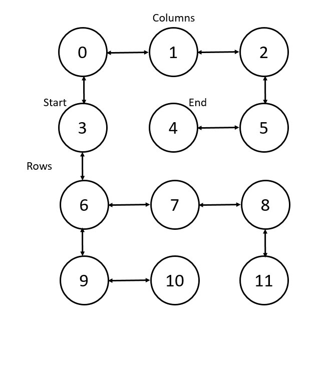

 # Project 4
## _Text Based Adventure Game_

# About/Overview:
This is my implementation of the Dungeon Text Based Adventure game that builds upon our Dungeon Model. A player enters the dungeon with nothing but their empty treasure sack, a bow, and 3 arrows in their quiver. The player then navigates the dungeon from their start point in search of their end point with the ability to pick up treasures and arrows as well as shoot those arrows in order to slay the monsters that await them in the dungeon. The player starts at a randomly selected point and  must navigate to a randomly selected end point at least 5 moves away. There will be at least one monster in the Dungeon at the end point but the user can ask for as many monsters as there are caves. Dungeons are represented as interconnected nodes where row 0, column 0 also known as index 0 is in the top left-hand corner and the index increases from left to right in the increasing x direction of the Cartesian plane(columns). It then drops to the next y position down and all the way to the left like a carriage return to do the same process for the second row. The example 4 row by 3 columns graph is below: 

If re-enabled, the program will print the start cave, end cave, and final list of edges to the screen after it has generated which will have the indexes of both caves connected by a bidirectional arrow(18<========>23).

# Features

- With the controller doing the dungeon building,(not the project spec, doesn't take command line args until you have already started the program)when the program starts the user is greeted and presented with the criteria for entering proper command line arguments for starting the dungeon model. The first level of error checking starts there. The controller ensures that the user enters at least true or false for the wrapping requirement and positive integers for rows, columns, interconnectivity, and percentage of caves with treasure. For the purpose of this project, the command line args are parsed by the driver and buids the player and dungeon before passing the model to the controller.

- The user has no real interaction with any constructors. The controller passes all of those arguments, once validated at the first level, to the constructor. From there the dungeon and player are automatically built and run.

- One unique design feature is the treasure implementation which is an enum and factory pattern all in one class. This makes the code slightly more compact as a single stop for construction and validation of treasure. This allows the program to easily identify treasure objects in the players treasure list and cleanly present them when called.

- Caves and edges have a lot of detail which will help for expanding capability going forward. Caves and tunnels know who they are neighbors with as well as where they are in the dungeon. Edges contain the two caves associated with them. They also know which direction to travel to get from
one cave to the other. In the next implementation, this will be used so that the player takes a direction of travel rather than an index to move through the dungeon. Caves also have a treasure list in them that if selected by the treasure placement method stores the randomly generated treasure.

- The Dungeon implementation will let the user try and build the smallest possible graph by allowing them to build any graph with at least 6 nodes. It may not be able to construct it the first time and will throw an error if it cannot build a correct start and end point based on the randomly selected start point.

- The constructor for the dungeon will also check for over interconnectivity, ensures there can't be more than 100% treasure in caves.

- As the player moves through the dungeon, they have the ability to pick up arrows and treasure at the same time if they are found together. Else they can pick up each set of items separately. 

- The player can either spell out the behaviour they want or use the first letter. For example if the player wants to move east they can either type "move east" or they can type "m e". This applies to all behaviours include shoot, pickup or even quit. 

- The player has the option to quit anytime they are prompted to move, shoot, or pickup by entering either quit or the letter q.

- The controller has the methods to both build the dungeon and play the game all in one. It implements the proper functionality to take in the command line arguments and pass them to the model for validation.

- With minor line changes, the program could be reconfigured to give more hints to the player as to where they are by adding situation updates providing the index of where the player is.

- The full print out of the final edges could also be included to help the player or other developers build features. It only takes one line change in the model to implement.  

# How To Run

## How to run the jar file
The way required for the specification takes the name of the file and the command line arguments for building a dungeon: [wrapping (boolean)] [# of rows (int)] [# of columns (int) ] [level of interconnectivity(int)] [percentage of treasure and arrows (int)] [level of difficulty/# of monsters(int greater than 0)]
"java -jar Project3_Dungeon_Model.jar [wrap] [row] [col] [inter] [treas] [dif]"

The driver can be changed to use the controller to process arguments but that requires the build dugeon function to be called in the driver and the model passed off to the driver at that point. You would also have to wait or the controller to prompt the user for arguments or include the arguments on a separate line for the driver.

# How to Use the Program. 
After the command line arguments are read in and the dungeon is constructed, the program will then drop the player in their starting cave telling them what the index is, what items if any are present in the cave, and which directions are available to them. The user will then be prompted to move, shoot, or pick up an item.

# Description of Examples/Example Runs

## Run 1 -- Run 1.txt:
1. Generates the dungeon based on the parameters passed(non-wrapping, 4 row by 3 column dungeon, level 0 interconnectivity, 50% treasure and arrows and level 1 difficulty).
2. It then drops the player in the starting cave and gives their current status.
3. The player then navigates the dungeon moving from cave to cave  picking up both arrows and treasure at the same time. Then move from cave to another cave where they pick up both arrows and treasure separately. At each step along the way the player's status is printed out which includes if they are in a cave or tunnel, what they currently have in their treasure bag, what direction they can move from that cave(North, South, East, and/or West), how many arrows they have in their quiver, and what treasure and arrows are in that cave that they will pick up.
4. The player then navigates back to cave 3 and then move north to cave 0 where they shoot an arrow 1 space east and hear a howl as the arrow hits the monster. 
5. The player then moves east and then south until they smell something "faint but awful(Monster is 2 spaces away) and then "The player smells something awful and strong."(a monster within 1 space or 2 monsters within 2 spaces
6. The player shoots again and hears "A great howl echos through the dungeon and a loud crash as the monster falls over dead."
7. The player then moves west where they reach the final cave discovering the monster's body and have reached their end point. 
8. The game terminates as they have reached their final destination. 

## Run 2 -- Run2.txt:
1. Generates the dungeon based on the parameters passed(non-wrapping, 4 row by 3 column dungeon, level 0 interconnectivity, 50% treasure and arrows and level 1 difficulty).
2. It then drops the player in the starting cave and gives their current status.
3. The player navigates north then moves east twice. The player smells something faint but awful. The player then moves south and smells something strong and awful.  
4. The player then moves west where they are eaten by the monster, "Chomp! Our player was eaten by a Monster."

# Design/Model Changes.

- I was able to simplify a lot of my code by passing whole objects instead .

- I was able to remove a bunch of code for executing the depth first and breadth first searches. 

- Made the player able to move via direction instead of by index like project 3 by implementing a lookup for my final edge list. 

- Lots of private methods were added to handle all the object passing and maintenance.

- I obviously added the Otyugh, the ability to shoot, the ability to smell the Otyugh, as well as the crooked arrow objects and spread them among the caves and tunnels at the same percentage as the treasure. 

- I changed how I updated the players update location method by decoupling the pickup method allowing the player the choice to pick up or not.

- I added a isAlive and reachedEnd method that checks if the player is alive or if the player has reached the end cave and the game is over. 

- I also changed my random number generator to more consistently produce the same results by producing just single random numbers with the same seed across the entire program.

- Changed my player status messages and output to allow the player to figure out where they are. I keep the possible strings to make it easier if the customer needs more help to find their way. 

# Assumptions

- A player will always want to pick up all treasure and doesn't have a limit to how much treasure they can carry. There is no point in not picking up all treasure in a cave. 

- The player does not care about any treasure or nodes in the cave that serves as the end point.

- A cave will only have 1 monster because they are solitary creatures. 

- A cave or tunnel will only have 1 arrow in it if it does have an arrow. This is to prevent the player from having tons of arrows and shooting them everywhere. The player will have to be strategic about how they use those arrows. 

# Limitations
- The player cannot pick up treasure or arrows in the final cave. The program will terminate because they have reached the end point. 

- Due to almost every method being private or package private it is hard to test the functionality without the testing being done in the same class or package.

# Citations. 
Madhira Datta walked me through how to calculate the maximum number of edges in a graph for wrapping and non wrapping dungeons. I also found the method to condense my treasure enum and factory into one class and adapted that code from https://connected2know.com/programming/java-factory-pattern/. All citations have in line citations.